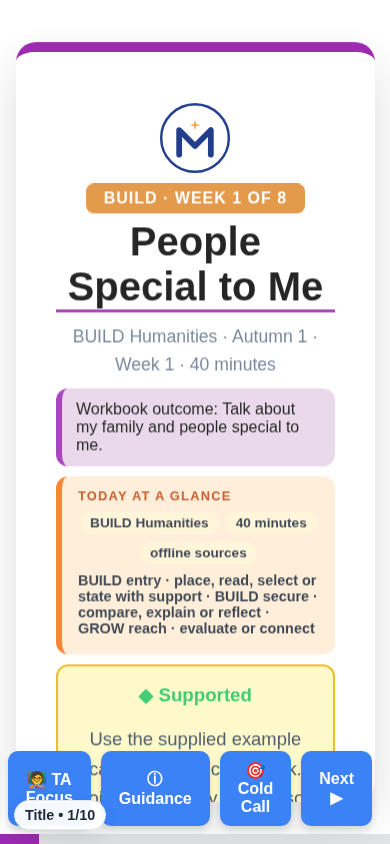
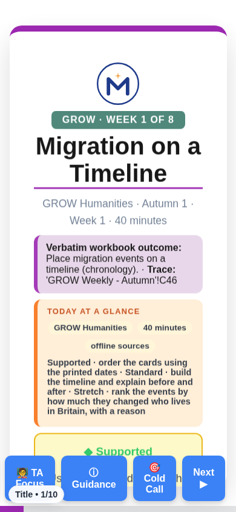
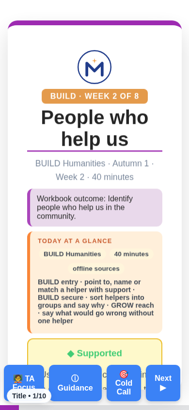
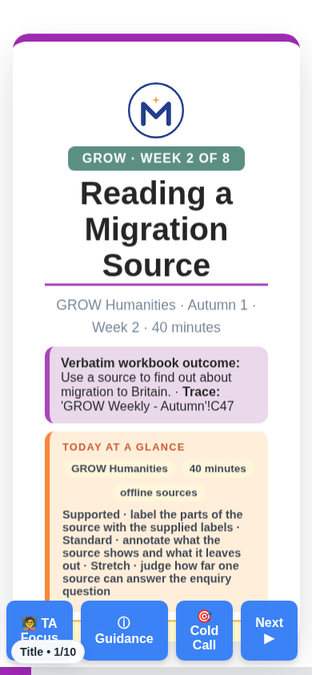
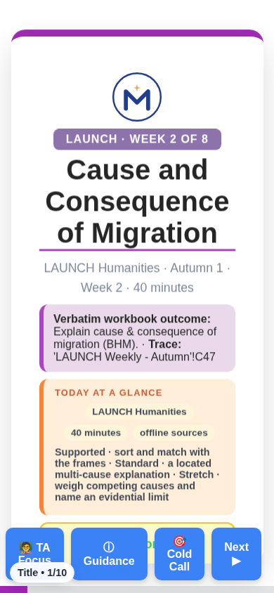
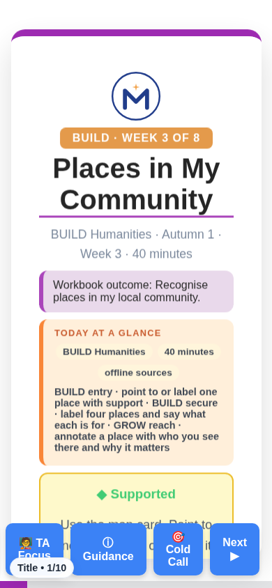
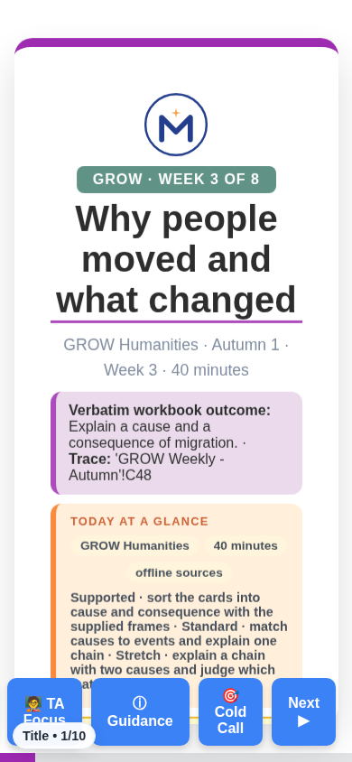
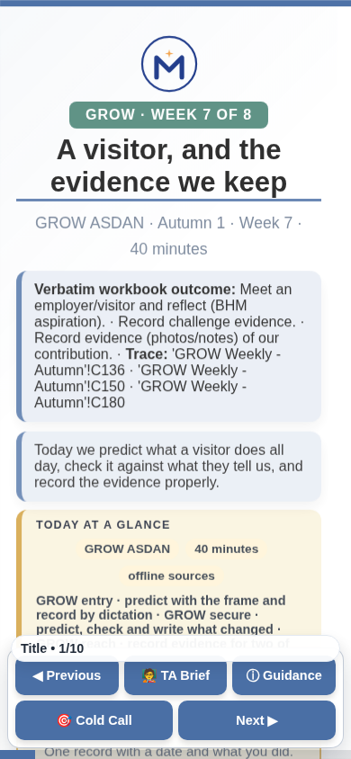
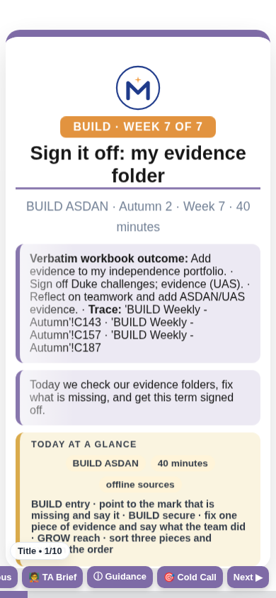

# REVIEW — run 11 (read this first)

Eight lessons moved from the n6 chassis to the classic house look. Same words, new shell. Open any one on your phone and it should look like the Art W1 deck: logo, week tag, title, outcome box, "Today at a Glance", three route cards, then the ten slides with the timer, the Reveal buttons and the Lundy Loop, and three print packs behind the 🖨 buttons.

Each screen below is the title slide at 390 px wide, taken by the proof script; the same folder holds the 1365 px screen, the n6 "before" screens, and the cold / Supported / Standard / Stretch PDFs.

## BW1 — BUILD HUM W1 People Special To Me

`Humanities_Teesside/BUILD_W1-W8_2026-27/BUILD_HUM_W1_People_Special_To_Me.html`

- **Shell:** classic BUILD Humanities donor `BUILD_HUM_W6_Plan_The_Story.html`; 10 slides, 14 print sections, 3 SVG, `lundy` references 24 → 38 (the strip survives on every slide, plus its own slide and print section).
- **Words:** 2473 → 4570 pupil-facing words (the print pack re-prints the slide text); containment PASS, 295 sentences all present.
- **Gates:** g16 v2 104/104 PASS; g26 reading PASS (band); g24 PASS; tier print proof PASS (cold print = Standard pack, never blank).
- **Check on the phone:** tap 🖨 Standard pack once — it should print ten sheets, the first a Knowledge Organiser. Swipe to the Lundy Loop slide — four boxes, SPACE / VOICE / AUDIENCE / INFLUENCE, in the deck's own words.

## GW1 — GROW HUM W1 Migration On A Timeline

`Humanities_Teesside/GROW_W1-W8_2026-27/GROW_HUM_W1_Migration_On_A_Timeline.html`

- **Shell:** classic GROW Humanities donor `GROW_HUM_W8_Where_In_The_World.html`; 10 slides, 14 print sections, 3 SVG, `lundy` references 24 → 38 (the strip survives on every slide, plus its own slide and print section).
- **Words:** 1886 → 3659 pupil-facing words (the print pack re-prints the slide text); containment PASS, 203 sentences all present.
- **Gates:** g16 v2 105/105 PASS; g26 reading PASS (band); g24 PASS; tier print proof PASS (cold print = Standard pack, never blank).
- **Check on the phone:** tap 🖨 Standard pack once — it should print ten sheets, the first a Knowledge Organiser. Swipe to the Lundy Loop slide — four boxes, SPACE / VOICE / AUDIENCE / INFLUENCE, in the deck's own words.

## LW1 — LAUNCH HUM W1 Migration And Identity In Modern Britain

`Humanities_Teesside/LAUNCH_W1-W8_2026-27/LAUNCH_HUM_W1_Migration_And_Identity_In_Modern_Britain.html`

- **Shell:** classic LAUNCH Humanities donor `LAUNCH_HUM_W8_OS_Map_Skills.html`; 10 slides, 14 print sections, 3 SVG, `lundy` references 24 → 38 (the strip survives on every slide, plus its own slide and print section).
- **Words:** 1720 → 3713 pupil-facing words (the print pack re-prints the slide text); containment PASS, 91 sentences all present.
- **Gates:** g16 v2 104/104 PASS; g26 reading PASS (ceiling); g24 PASS; tier print proof PASS (cold print = Standard pack, never blank).
- **Check on the phone:** tap 🖨 Standard pack once — it should print ten sheets, the first a Knowledge Organiser. Swipe to the Lundy Loop slide — four boxes, SPACE / VOICE / AUDIENCE / INFLUENCE, in the deck's own words.

## BW2 — BUILD HUM W2 People Who Help Us

`Humanities_Teesside/BUILD_W1-W8_2026-27/BUILD_HUM_W2_People_Who_Help_Us.html`

- **Shell:** classic BUILD Humanities donor `BUILD_HUM_W6_Plan_The_Story.html`; 10 slides, 14 print sections, 3 SVG, `lundy` references 24 → 38 (the strip survives on every slide, plus its own slide and print section).
- **Words:** 2503 → 4497 pupil-facing words (the print pack re-prints the slide text); containment PASS, 327 sentences all present.
- **Gates:** g16 v2 104/104 PASS; g26 reading PASS (band); g24 PASS; tier print proof PASS (cold print = Standard pack, never blank).
- **Check on the phone:** tap 🖨 Standard pack once — it should print ten sheets, the first a Knowledge Organiser. Swipe to the Lundy Loop slide — four boxes, SPACE / VOICE / AUDIENCE / INFLUENCE, in the deck's own words.

## GW2 — GROW HUM W2 Reading A Migration Source

`Humanities_Teesside/GROW_W1-W8_2026-27/GROW_HUM_W2_Reading_A_Migration_Source.html`

- **Shell:** classic GROW Humanities donor `GROW_HUM_W8_Where_In_The_World.html`; 10 slides, 14 print sections, 3 SVG, `lundy` references 24 → 38 (the strip survives on every slide, plus its own slide and print section).
- **Words:** 1857 → 3709 pupil-facing words (the print pack re-prints the slide text); containment PASS, 202 sentences all present.
- **Gates:** g16 v2 105/105 PASS; g26 reading PASS (band); g24 PASS; tier print proof PASS (cold print = Standard pack, never blank).
- **Check on the phone:** tap 🖨 Standard pack once — it should print ten sheets, the first a Knowledge Organiser. Swipe to the Lundy Loop slide — four boxes, SPACE / VOICE / AUDIENCE / INFLUENCE, in the deck's own words.

## LW2 — LAUNCH HUM W2 Cause And Consequence Of Migration

`Humanities_Teesside/LAUNCH_W1-W8_2026-27/LAUNCH_HUM_W2_Cause_And_Consequence_Of_Migration.html`

- **Shell:** classic LAUNCH Humanities donor `LAUNCH_HUM_W8_OS_Map_Skills.html`; 10 slides, 14 print sections, 3 SVG, `lundy` references 24 → 38 (the strip survives on every slide, plus its own slide and print section).
- **Words:** 1725 → 3672 pupil-facing words (the print pack re-prints the slide text); containment PASS, 90 sentences all present.
- **Gates:** g16 v2 104/104 PASS; g26 reading PASS (ceiling); g24 PASS; tier print proof PASS (cold print = Standard pack, never blank).
- **Check on the phone:** tap 🖨 Standard pack once — it should print ten sheets, the first a Knowledge Organiser. Swipe to the Lundy Loop slide — four boxes, SPACE / VOICE / AUDIENCE / INFLUENCE, in the deck's own words.

## BW3 — BUILD HUM W3 Places In My Community

`Humanities_Teesside/BUILD_W1-W8_2026-27/BUILD_HUM_W3_Places_In_My_Community.html`

- **Shell:** classic BUILD Humanities donor `BUILD_HUM_W6_Plan_The_Story.html`; 10 slides, 14 print sections, 3 SVG, `lundy` references 24 → 38 (the strip survives on every slide, plus its own slide and print section).
- **Words:** 2514 → 4439 pupil-facing words (the print pack re-prints the slide text); containment PASS, 324 sentences all present.
- **Gates:** g16 v2 104/104 PASS; g26 reading PASS (band); g24 PASS; tier print proof PASS (cold print = Standard pack, never blank).
- **Check on the phone:** tap 🖨 Standard pack once — it should print ten sheets, the first a Knowledge Organiser. Swipe to the Lundy Loop slide — four boxes, SPACE / VOICE / AUDIENCE / INFLUENCE, in the deck's own words.

## GW3 — GROW HUM W3 Why People Moved And What Changed

`Humanities_Teesside/GROW_W1-W8_2026-27/GROW_HUM_W3_Why_People_Moved_And_What_Changed.html`

- **Shell:** classic GROW Humanities donor `GROW_HUM_W8_Where_In_The_World.html`; 10 slides, 14 print sections, 3 SVG, `lundy` references 24 → 38 (the strip survives on every slide, plus its own slide and print section).
- **Words:** 1956 → 3897 pupil-facing words (the print pack re-prints the slide text); containment PASS, 209 sentences all present.
- **Gates:** g16 v2 105/105 PASS; g26 reading PASS (band); g24 PASS; tier print proof PASS (cold print = Standard pack, never blank).
- **Check on the phone:** tap 🖨 Standard pack once — it should print ten sheets, the first a Knowledge Organiser. Swipe to the Lundy Loop slide — four boxes, SPACE / VOICE / AUDIENCE / INFLUENCE, in the deck's own words.

## What was not done

- No trims: none of the six D-E overload decks is among these eight.
- g10 reds on the house heading labels of the classic chassis ("Arrival Task", "Independent Work") and on title fragments; every candidate was inspected and none is a person (`evidence/run11/G10_CLASSIC_HOUSE_LABELS.json`). Ruling wanted: a HOUSE_LABELS register like PLACES.md.
- The n6-shaped FEB gates (g18, g11, s24, running heads, g21, rig, g23, g25) cannot parse a classic deck; recorded as measured, not applicable (`evidence/run11/FEB_GATES_ON_CLASSIC.json`).

## Two new lessons — first of their family on v2 (STOP-AND-PRINT)

### GAW7 — A visitor, and the evidence we keep (GROW ASDAN · week 7)

`GROW_ASDAN/Autumn1_W7_2026-27/GROW_ASDAN_W7_A_Visitor_And_The_Evidence_We_Keep.html`

- **Cells:** C136, C150, C180 — three workbook cells in one 40-minute lesson, on the classic ASDAN shell (Today at a Glance, The Model, Proving It, Independent Work, Lundy Loop, Exit Ticket; intro sheet and Assessor Witness Statement in the print pack).
- **Gates:** g16 v2 96/96 PASS; reading None (None, PASS); g24 PASS; g15 PASS; tier print proof PASS (cold = Standard, 3959 chars).
- **Check on the phone:** the title, the outcome box with the three cells, Today at a Glance, then the route cards. If this is the wrong look for ASDAN, say so before any more ASDAN lessons are built.

### BAW15 — Sign it off: my evidence folder (BUILD ASDAN · week 15)

`BUILD_ASDAN/Autumn2_W7_2026-27/BUILD_ASDAN_W15_Sign_It_Off_My_Evidence_Folder.html`

- **Cells:** C143, C157, C187 — three workbook cells in one 40-minute lesson, on the classic ASDAN shell (Today at a Glance, The Model, Proving It, Independent Work, Lundy Loop, Exit Ticket; intro sheet and Assessor Witness Statement in the print pack).
- **Gates:** g16 v2 96/96 PASS; reading None (None, PASS); g24 PASS; g15 PASS; tier print proof PASS (cold = Standard, 4444 chars).
- **Check on the phone:** the title, the outcome box with the three cells, Today at a Glance, then the route cards. If this is the wrong look for ASDAN, say so before any more ASDAN lessons are built.
