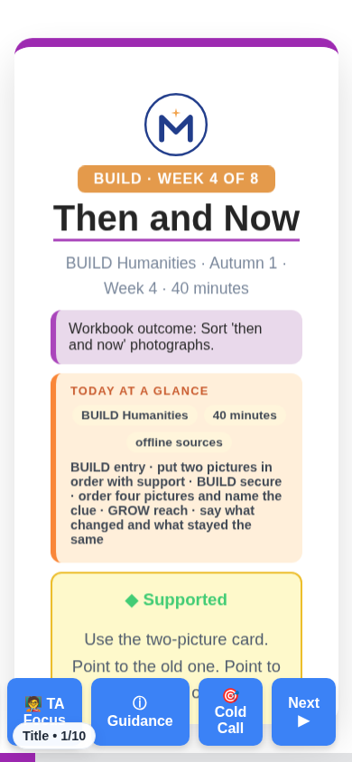
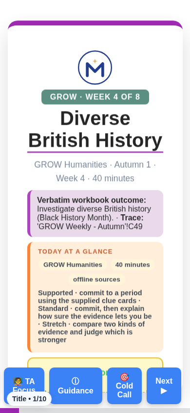
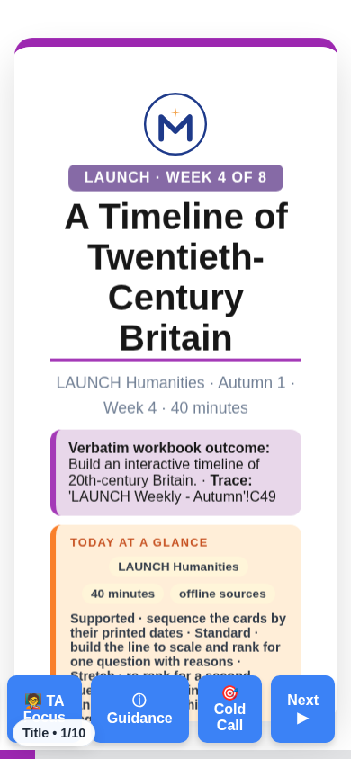
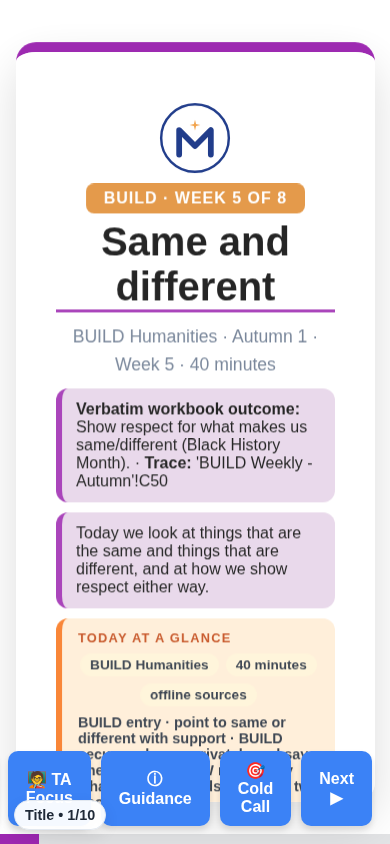
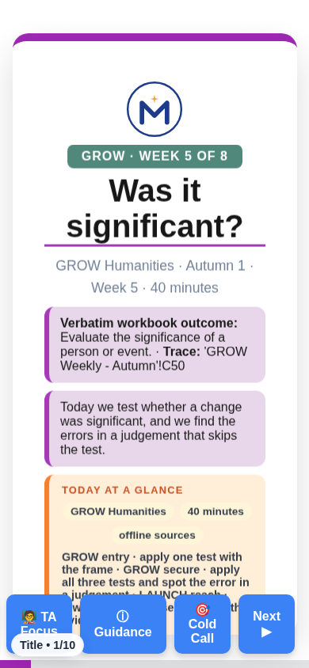
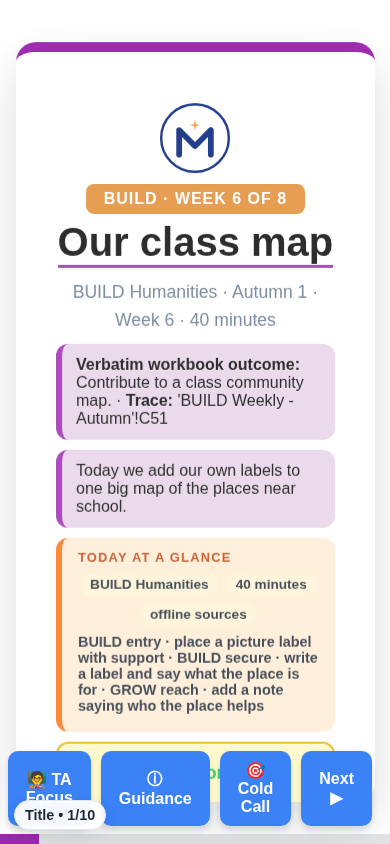

# REVIEW — run 12-A (read this first)

Eight more lessons moved from the n6 chassis to the classic house look, and the whole classic estate had two shell fixes. Same words, right shell, and a cold print now gives you the Standard pack on every classic deck but ten.

## Two things you should know before the screens

**No new lesson was built this run, and that is the main finding.** Five were
authored. Every one of them claims workbook cells a deck already standing in the
estate serves. Three got all the way through the gates first — twenty-six green
results across three decks — and the gates could not see it, because a gate asks
whether a deck is well made, not whether it should exist.

The reason the target list was wrong: the spine re-key in run 11 changed labels
and left filenames alone, on purpose ("text only, zero renames"). So a deck
filename still counts weeks the old way while the deck's own labels count them
the new way, and the tool that picks targets was reading the filename. The deck
called `BUILD_ASDAN_W16_Partner_Challenge_and_Seasonal_Goals` cites the cells for
week 17. Ask for week 17 and the tool says it is empty.

There is a check now that does not care about weeks at all: does any deck already
claim this cell? A cell is a cell. It is what caught all five, and it runs before
the build from here on.

**Two of the eight decks below leave one name-pair unresolved**, the same pair on
both: "Diverse British", from the lesson titles. It is not a person. It does not
resolve because the place register holds "Britain" and not "British". One ruling
clears both. It is written up in `evidence/run12/G10_RESIDUE_RUN12.json` rather
than fixed here, because extending a register you ruled on is not this run's to
do. The other six pass with nothing unresolved.

Each screen below is the title slide at 390 px, taken by the proof script. The same folder holds the 1365 px screen, the n6 "before" screens, and the cold / Supported / Standard / Stretch PDFs.

## LW3 — LAUNCH HUM W3 Evaluating A Digital Archive Source

`Humanities_Teesside/LAUNCH_W1-W8_2026-27/LAUNCH_HUM_W3_Evaluating_A_Digital_Archive_Source.html`

- **Shell:** classic LAUNCH Humanities donor `LAUNCH_HUM_W8_OS_Map_Skills.html`; 10 slides, 14 print sections, 3 SVG, `lundy` references 24 → 38.
- **Words:** 1757 → 3753 pupil-facing; containment PASS, all 87 sentences present verbatim.
- **Gates:** g16 v2 104/104 PASS; reading FK 12.91 pupil / 12.12 whole (PASS, ceiling); g24 PASS; tier print proof PASS (cold = Standard, 9213 chars).
- **Check on the phone:** tap 🖨 Standard pack — ten sheets, the first a Knowledge Organiser. Swipe to the Lundy Loop slide: four boxes in the deck's own words.

## BW4 — BUILD HUM W4 Then And Now

`Humanities_Teesside/BUILD_W1-W8_2026-27/BUILD_HUM_W4_Then_And_Now.html`

- **Shell:** classic BUILD Humanities donor `BUILD_HUM_W6_Plan_The_Story.html`; 10 slides, 14 print sections, 3 SVG, `lundy` references 24 → 38.
- **Words:** 2521 → 4507 pupil-facing; containment PASS, all 326 sentences present verbatim.
- **Gates:** g16 v2 104/104 PASS; reading FK 2.84 pupil / 3.06 whole (PASS, band); g24 PASS; tier print proof PASS (cold = Standard, 7486 chars).
- **Check on the phone:** tap 🖨 Standard pack — ten sheets, the first a Knowledge Organiser. Swipe to the Lundy Loop slide: four boxes in the deck's own words.

## GW4 — GROW HUM W4 Diverse British History

`Humanities_Teesside/GROW_W1-W8_2026-27/GROW_HUM_W4_Diverse_British_History.html`

- **Shell:** classic GROW Humanities donor `GROW_HUM_W8_Where_In_The_World.html`; 10 slides, 14 print sections, 3 SVG, `lundy` references 24 → 38.
- **Words:** 1982 → 3853 pupil-facing; containment PASS, all 204 sentences present verbatim.
- **Gates:** g16 v2 105/105 PASS; reading FK 4.95 pupil / 5.15 whole (PASS, band); g24 PASS; tier print proof PASS (cold = Standard, 7446 chars).
- **Check on the phone:** tap 🖨 Standard pack — ten sheets, the first a Knowledge Organiser. Swipe to the Lundy Loop slide: four boxes in the deck's own words.

## LW4 — LAUNCH HUM W4 A Timeline Of Twentieth Century Britain

`Humanities_Teesside/LAUNCH_W1-W8_2026-27/LAUNCH_HUM_W4_A_Timeline_Of_Twentieth_Century_Britain.html`

- **Shell:** classic LAUNCH Humanities donor `LAUNCH_HUM_W8_OS_Map_Skills.html`; 10 slides, 14 print sections, 3 SVG, `lundy` references 24 → 38.
- **Words:** 1736 → 3468 pupil-facing; containment PASS, all 84 sentences present verbatim.
- **Gates:** g16 v2 104/104 PASS; reading FK 12.86 pupil / 11.94 whole (PASS, ceiling); g24 PASS; tier print proof PASS (cold = Standard, 7652 chars).
- **Check on the phone:** tap 🖨 Standard pack — ten sheets, the first a Knowledge Organiser. Swipe to the Lundy Loop slide: four boxes in the deck's own words.

## BW5 — BUILD HUM W5 Same And Different

`Humanities_Teesside/BUILD_W1-W8_2026-27/BUILD_HUM_W5_Same_And_Different.html`

- **Shell:** classic BUILD Humanities donor `BUILD_HUM_W6_Plan_The_Story.html`; 10 slides, 14 print sections, 3 SVG, `lundy` references 24 → 38.
- **Words:** 2330 → 4107 pupil-facing; containment PASS, all 303 sentences present verbatim.
- **Gates:** g16 v2 104/104 PASS; reading FK 3.04 pupil / 3.24 whole (PASS, band); g24 PASS; tier print proof PASS (cold = Standard, 6637 chars).
- **Check on the phone:** tap 🖨 Standard pack — ten sheets, the first a Knowledge Organiser. Swipe to the Lundy Loop slide: four boxes in the deck's own words.

## GW5 — GROW HUM W5 Was It Significant

`Humanities_Teesside/GROW_W1-W8_2026-27/GROW_HUM_W5_Was_It_Significant.html`

- **Shell:** classic GROW Humanities donor `GROW_HUM_W8_Where_In_The_World.html`; 10 slides, 14 print sections, 3 SVG, `lundy` references 24 → 38.
- **Words:** 1512 → 2880 pupil-facing; containment PASS, all 162 sentences present verbatim.
- **Gates:** g16 v2 105/105 PASS; reading FK 6.19 pupil / 6.22 whole (PASS, band); g24 PASS; tier print proof PASS (cold = Standard, 5651 chars).
- **Check on the phone:** tap 🖨 Standard pack — ten sheets, the first a Knowledge Organiser. Swipe to the Lundy Loop slide: four boxes in the deck's own words.

## LW5 — LAUNCH HUM W5 Who Shaped Britain

`Humanities_Teesside/LAUNCH_W1-W8_2026-27/LAUNCH_HUM_W5_Who_Shaped_Britain.html`

- **Shell:** classic LAUNCH Humanities donor `LAUNCH_HUM_W8_OS_Map_Skills.html`; 10 slides, 14 print sections, 3 SVG, `lundy` references 24 → 38.
- **Words:** 1229 → 2492 pupil-facing; containment PASS, all 109 sentences present verbatim.
- **Gates:** g16 v2 104/104 PASS; reading FK 8.83 pupil / 8.59 whole (PASS, ceiling); g24 PASS; tier print proof PASS (cold = Standard, 5166 chars).
- **Check on the phone:** tap 🖨 Standard pack — ten sheets, the first a Knowledge Organiser. Swipe to the Lundy Loop slide: four boxes in the deck's own words.

## BW6 — BUILD HUM W6 Our Class Map

`Humanities_Teesside/BUILD_W1-W8_2026-27/BUILD_HUM_W6_Our_Class_Map.html`

- **Shell:** classic BUILD Humanities donor `BUILD_HUM_W6_Plan_The_Story.html`; 10 slides, 14 print sections, 3 SVG, `lundy` references 24 → 38.
- **Words:** 2193 → 3891 pupil-facing; containment PASS, all 279 sentences present verbatim.
- **Gates:** g16 v2 104/104 PASS; reading FK 3.32 pupil / 3.42 whole (PASS, band); g24 PASS; tier print proof PASS (cold = Standard, 6274 chars).
- **Check on the phone:** tap 🖨 Standard pack — ten sheets, the first a Knowledge Organiser. Swipe to the Lundy Loop slide: four boxes in the deck's own words.

## The two shell fixes, estate-wide

- **Tokens.** 141 classic decks defined a palette token twice inside `:root`. Every redefinition now sits under `html.pathway-<lane>` and each token is defined once. Proved deck by deck: the value your browser resolves is identical, the screen is identical, the print pack is identical.
- **Cold print.** 86 more decks got the fix that makes ⌘P give you the Standard pack instead of a blank page. Every live classic deck now prints cold except ten GROW Science v3 decks whose print button works differently; those are held by name and still print blank.

## What was not done

- No trims this run: none of the six overload decks is among these eight.
- The ten held decks (`Science_Teesside/Grow/v3_40min/`) need a look at their own print mechanism before anything is changed there.
- Subject terminology ("Solar System", "Stem Cells", "Fair Test") still reads as an unresolved name-shaped pair to the g10 gate. The house register covers tier, stage, loop, pathway and event vocabulary, which is what the ruling named; subject terms would be a separate register and a separate ruling.
